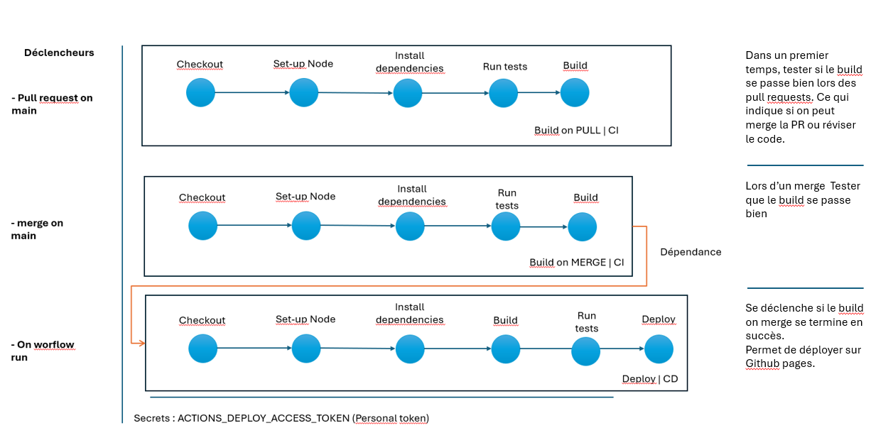

# Challenge ReactJs + API Plateform + CI/CD 

Rendu du projet

## Répos Github
- [Platform Client](https://aliciasaci.github.io/platform-react-cicd-challenge/)
- [Backoffice Admin](https://aliciasaci.github.io/backoffice-challenge-5S1/)
- [Server](https://gentle-chamber-06249-b77e1a20e14f.herokuapp.com/api)

## Sites 
- [Platform Client](https://github.com/Aliciasaci/platform-react-cicd-challenge)
- [Backoffice Admin](https://github.com/Aliciasaci/backoffice-challenge-5S1)
- [Server](https://github.com/Londones/server)

## Nom de chacun de nos comptes Github
- Alicia SACI : Aliciasaci 
- Awa BAH : Londones
- Mai thi TRANS DIEP :  maithi-trandiep 
- Viet ANH :  vietanh2810 

## Distribution des tâches
 # 1. Alicia SACI
    
   ### 1.1 ReactJS + API Plateform
 - Login / register (front et back)
 - Recherche de prestation (par établissement, titre, et categorie)(front et back)
 - Auth JWT (front et back)
 - Création d'un calendrier Custom pour les reservations avec choix de l'employé et du créneau (Front et back)
 - Page prestation (Front et back)
 - Profil Client avec information personnelle et possibilité de modifier le mot de passe (front et back)
 - Prise de réservations à travers le calendrier (front et back)
 - Gestion des réservation (Annuler, reprendre, et la déplacer) (front et back)
 - Consulter les réservation (à venir, annulée(s) et passée(s))(front et back)
 - Création des Feedback (note par crière de la catégorie d'appartence de la prestation + moyenne globale de la prestation)(front et back)
 - Fixtures pour les entités "Critère" et "Feedback"(front et back)
 - Fixes sécurité

    ### 1.2 CI / CD 
  - Mise en prod des deux sites "backoffice" et "plateform client"
  - CI / CD pour les deux répo Platform Client et Backoffice Admin (Avec Mai THI TRANS DIEP)
   
    - Workflow "BUILD ON PULL | CI"
    - Workflow "BUILD ON MERGE | CI" 
    - Workflow "DEPLOY | CD"

    ### Schéma explicatif de la CI/CD
    

  
  # 2. AWA BAH
    
   ### 2.1 ReactJS + API Plateform
   - Création de la page d'établissement unique (avec un ID), front et back
   - Création de la liste des etablissement après passage du filtre (avec affichage de la map et de leur coordonnées)
   - Ajout de la traduction sur le site
   - Création de coposants divers pour integration multiple (notamment les prestation qui s'affichent sur la page etablissement et dans la reservation)
   - Travail d'optimisation des requetes et séparation des fichiers en React
   - Création du systeme de persitance de connexion et de la connexion sur le backoffice
   - Ajout de sécurité sur les routes concernant l'entité User
   - Création de tests jest sur des composants react et phpunit
   - Créations des fixtures (ajout des references sur category), etablissement, prestations et user

   ### 2.2 CI / CD 
  
  # 3. Mai Thi TRANS DIEP
    
   ### 3.1 ReactJS + API Plateform

   ### 3.2 CI / CD 

  # 4. Viet Anh
    
   ### 4.1 ReactJS + API Plateform

   ### 4.2 CI / CD 
